# full-cycle-2.0-kafka

Files I produced during the Apache Kafka classes of my [Microservices Full Cycle 2.0 course](https://drive.google.com/file/d/1MdN-qK_8Pfg6YI3TSfSa5_2-FHmqGxEP/view?usp=sharing).

# Theory

## Kafka basic functioning

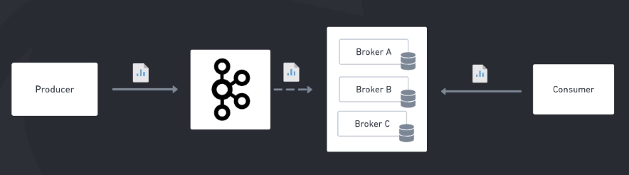

## Topics

Usually you will want to have the topic partitions inside different brokers. So you can imagine that the partitions 1, 2 and 3 are in different machines. If one machine dies, you have 2/3 of the messages of this topic in other brokers.

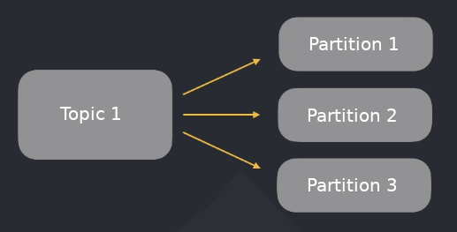

You can also choose to duplicate the partitions and distribute them along all brokers using Replication Factor = 2. In this way, if one broker dies, you will have the same partition in another one.

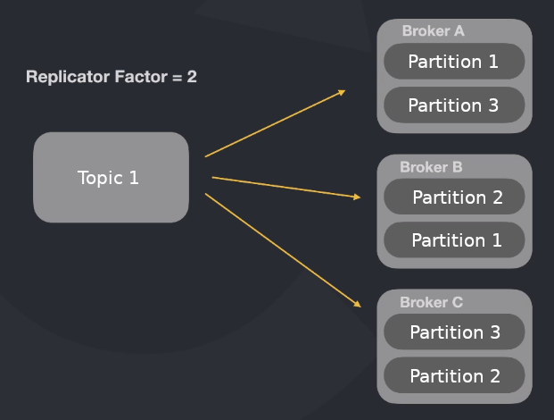

## Partitions

Each topic has associated partitions. Kafka saves messages sequentially to disk!

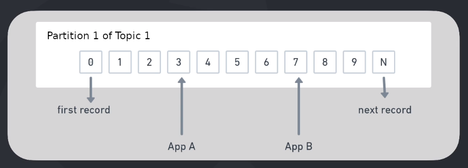

## Message structure

- Headers are metadata you can include in the message
- Key is used to send the same type of messages to the same partition
- Value is the payload itself
- Timestamp can be set by the producer or the kafka cluster when the message arrive

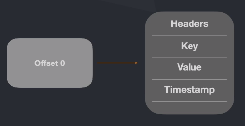

## Partition leadership

When you have Replication Factor greater than 1, Kafka will elect one of the partition replicas as the leader. That means the consumers will always read the leader messages.

This is useful because if one broker dies and it has a leader partition, Kafka will elect one of the partition replicas as the new leader.

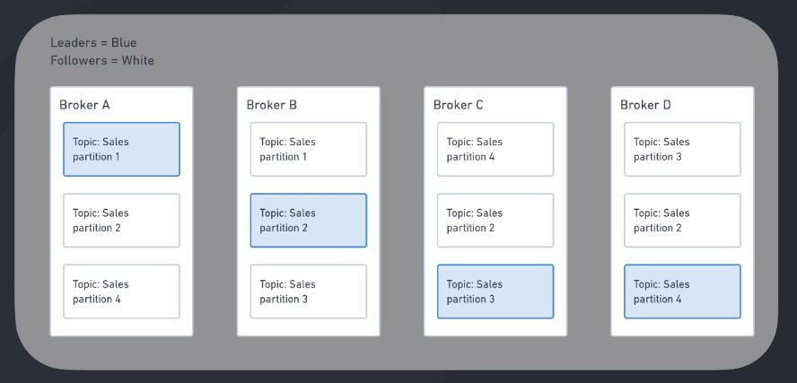

## Delivery guarantee

Kafka comes with 3 types of message delivery guarantee:

- If you send a message with Ack 0, Kafka will return "None" instantly without delivery guarantee.

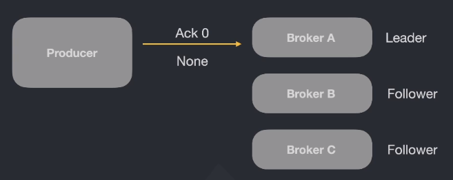

- If you send a message with Ack 1, Kafka will return "Leader" after the message is stored on it.


- If you send a message with Ack -1, Kafka will return "All" after the message is stored on the leader and the followers.

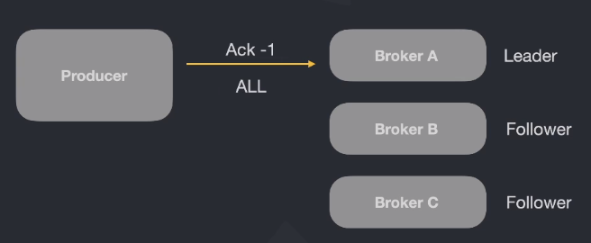

## More about delivery guarantee

Kafka comes with other types of message delivery guarantee:

- "At most once" gives you the best performance but don't guarantee that all messages will be delivered.


- "At least once" gives you a moderate performance but can delivery two times the same message. So, you need to take care of not processing the same message in your system!


- "Exactly once" gives you the worst performance but delivery all messages exactly one time.


## Producer idempotence

If a producer sends a message and it has a connectivity problem, maybe Kafka may have received and processed the message but the producer will send the message again when it come back.

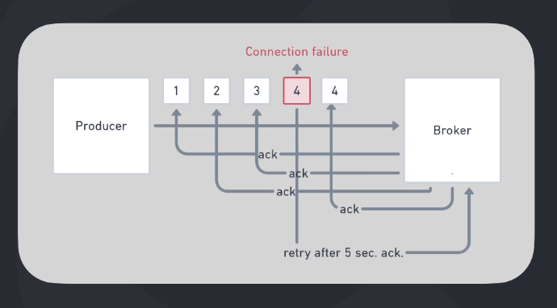

This is a problem because the message will be duplicated. If you say a producer is idempotent, Kafka will notice the situation and discard one of the messages.

## Consumers and consumer groups

If only one consumer is consuming a topic, it will read from all partitions.

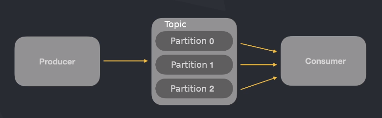

But you can create a group of consumers that read from the same topic. In this way, they divide the partitions between them.

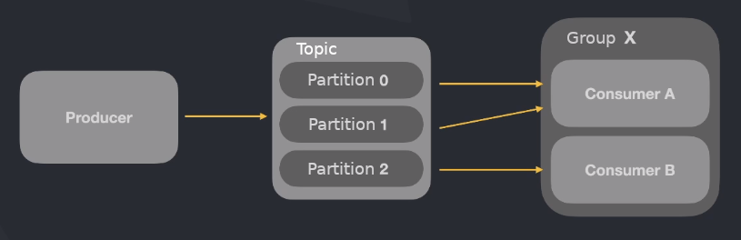

# Practice

## Starting Kafka

```sh
docker-compose up -d
# After some minutes, go inside kafka container:
docker-compose exec kafka bash
```

## Creating the first topic

```sh
kafka-topics --bootstrap-server=localhost:9092 --create --topic=teste --partitions=3
kafka-topics --bootstrap-server=localhost:9092 --list
kafka-topics --bootstrap-server=localhost:9092 --describe --topic=teste
```

## Consuming the first topic

```sh
kafka-console-consumer --bootstrap-server=localhost:9092 --topic=teste
# Let this terminal open. The consumer is listening to the topic!
```

## Producing messages in the first topic

Open another terminal and run:

```sh
kafka-console-producer --bootstrap-server=localhost:9092 --topic=teste
# This will open a console that you can send messages via keyboard input
```

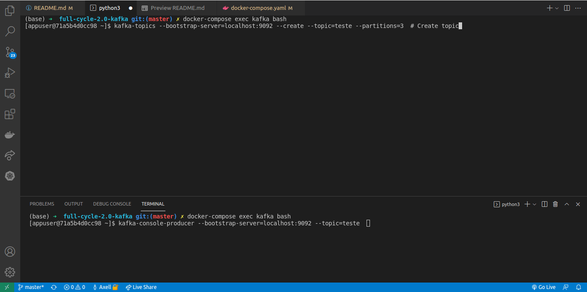

